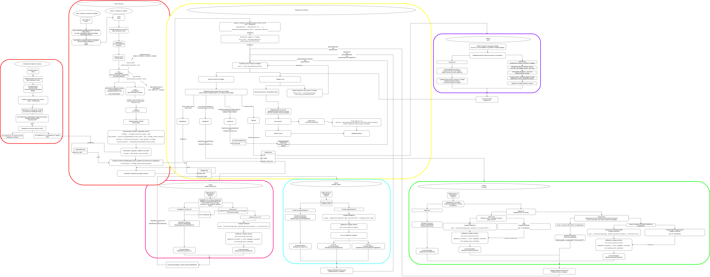

# Market Bots

Cобытийно-ориентированный фреймворк на Python для разработки, бэктестинга и (в будущем) запуска алгоритмических торговых стратегий в sandbox и live режимах на Tinkoff бирже (возможно на криптобиржах)

## О проекте
Предназначен для проверки торговых идей на исторических данных.

**Текущие возможности:**
*   **Базовый бэктестер:** Базовая симуляция работы стратегии на исторических данных свеча за свечой.
*   **Работа с локальными данными:** Бэктест проводится на предварительно скачанных данных.
*   **Возможность скачивания исторических данных** Скачивание происходит через API Tinkoff
*   **Гибкое управление риском:** Поддержка нескольких моделей расчета стоп-лосса, тейк-профита и размера позиции:
    *   **FIXED:** На основе фиксированного процента от капитала.
    *   **ATR:** На основе волатильности (индикатор Average True Range).
*   **Возможность добавления стратегий:** Добавление новых стратегий созданием файла с новым классом, наследующим абстрактный базовый класса.
*   **Базовый анализ:** Генерация отчетов с ключевыми метриками (PnL, Win Rate, Max Drawdown и др.) и графиком капитала.
*   **Массовое тестирование:** Возможность запуска одной стратегии сразу на множестве скачанных инструментов.

## Архитектура

Основной принцип работы фреймворка — разделение логики на независимые компоненты, которые общаются через центральную очередь событий.



## Быстрый старт

**Требования:** Python 3.12.10 (тестировалось на этой версии).

### 1. Установка

```bash
# 1. Клонировать репозиторий
git clone https://github.com/UseUseless/market_bots.git
cd market_bots

# 2. Создать и активировать виртуальное окружение
python -m venv .venv
# Для Linux/MacOS:
source .venv/bin/activate
# Для Windows:
# .venv\Scripts\activate

# 3. Установить зависимости
pip install -r requirements.txt
```

### Конфигурация

Для работы с API Tinkoff необходимо получить токен.

1.  Скопируйте файл `.env.example` и переименуйте его в `.env`.
2.  Откройте файл `.env` и вставьте свои токены. Для работы фреймворка **обязательно** нужен `TINKOFF_TOKEN_READONLY`.

## Порядок работы

### Шаг 1: Настройка параметров (config.py)

Все основные настройки находятся в файле `config.py`. **Перед началом работы откройте этот файл и настройте его под себя.**

### Шаг 2: Скачивание данных

Используйте скрипт `download_data.py` для скачивания исторических данных. Период загрузки и папка для сохранения настраиваются в `config.py`.

**Пример:** Скачать 5-минутные свечи для Сбербанка (`BBG004730N88`).
```bash
python download_data.py --figi BBG004730N88 --interval 5min
```
*   `--figi`: Один или несколько FIGI через пробел.
*   `--interval`: Таймфрейм (`1min`, `5min`, `15min`, `1hour`, `1day` и т.д.).

### Шаг 3: Создание своей стратегии

1.  Создайте Python-файл в папке `strategies/`.
2.  Создайте в нем класс, наследуемый от `BaseStrategy`.
3.  Добавьте секцию для вашей стратегии в `STRATEGY_CONFIG` в файле `config.py`.
4.  Реализуйте обязательные свойства и методы, считывая параметры из конфига.

    *   **Свойства:** `@property` для `candle_interval`, `stop_loss_percent`, `take_profit_percent`.
    *   **Методы:** `prepare_data` (расчет индикаторов) и `calculate_signals` (торговая логика).

5.  Импортируйте и зарегистрируйте свою стратегию в `AVAILABLE_STRATEGIES` в файле `run.py`.

### Шаг 4: Запуск бэктеста

#### Запуск для одного инструмента

Используйте `run.py` для детального тестирования на одном инструменте с различными параметрами.

**Базовый запуск (используются настройки по умолчанию):**
```bash
# Запустить TripleFilterStrategy на Сбербанке.
# Будет использован таймфрейм из конфига стратегии (5min) и риск-менеджер по умолчанию (FIXED).
python run.py --mode backtest --strategy triple_filter --figi BBG004730N88
```

**Запуск с риск-менеджером на основе ATR:**
```bash
# Используем флаг --rm (или --risk_manager) для выбора модели риска.
# Параметры для ATR (период, множители) берутся из RISK_CONFIG.
python run.py --mode backtest --strategy triple_filter --figi BBG004730N88 --rm ATR
```

**Запуск на другом таймфрейме:**
```bash
# Используем флаг --interval, чтобы переопределить таймфрейм из конфига стратегии.
# Убедитесь, что данные для этого интервала предварительно скачаны.
python run.py --mode backtest --strategy triple_filter --figi BBG004730N88 --interval 15min
```

**Комбинированный запуск (максимальная гибкость):**
```bash
# Тестируем стратегию на 15-минутном интервале с моделью риска ATR.
python run.py --mode backtest --strategy triple_filter --figi BBG004730N88 --rm ATR --interval 15min
```

#### Массовый запуск

Используйте `batch_tester.py` для быстрого прогона стратегии на всех скачанных инструментах для заданного интервала.

**Запуск с риск-менеджером по умолчанию (FIXED):**
```bash
# Запустить triple_filter на всех скачанных 5-минутных данных.
# Флаг --rm не указан, поэтому используется значение по умолчанию: FIXED.
python batch_tester.py --strategy triple_filter --interval 5min
```

**Запуск с риск-менеджером ATR:**
```bash
# Теперь можно явно указать модель риска для массового теста.
# Эта команда запустит triple_filter на всех 5-минутных данных с моделью риска ATR.
python batch_tester.py --strategy triple_filter --interval 5min --rm ATR
```

## Результаты работы

Папки для результатов настраиваются в `PATH_CONFIG` в файле `config.py`. По умолчанию:

*   `data/`: Скачанные исторические данные.
*   `logs/`: Логи выполнения (`_run.log`) и сделок (`_trades.csv`).
*   `reports/`: Графические отчеты (`.png`).

## Кастомизация анализа

Логика расчета метрик и построения графика находится в файле `analyzer.py`. Вы можете изменить или добавить новые метрики в методе `calculate_metrics` класса `BacktestAnalyzer`.

### Визуальный дашборд для анализа

В проекте есть интерактивная панель для визуального анализа и сравнения результатов всех бэктестов.

**Возможности:**
*   Сводная таблица всех прогонов с ключевыми метриками.
*   Фильтры по стратегии, инструменту и риск-менеджеру.
*   Интерактивные графики: кривая капитала, просадки, распределение PnL.

**Как запустить:**
Выполните в терминале:
    ```bash
    streamlit run dashboard.py
    ```

Дашборд автоматически откроется в вашем браузере.

### Также для базовой проверки стратегии добавлен расчет стратегии "Buy and Hold".

Для чего она? 
Отвечает на вопрос: "Наша стратегия оказалась лучше, чем просто владение этим активом (закупиться на весь капитал в первый день)?"

Выявляет "пустые" стратегии: Если твоя сложная стратегия с десятком индикаторов и ML-моделью по итогу заработала 15%, а простое владение активом за тот же период принесло 30%, то твоя стратегия неэффективна. Она не создает дополнительной ценности (альфы).

Дает контекст: Помогает понять, была ли прибыль результатом гениальности стратегии или просто весь рынок рос (и любая покупка принесла бы деньги).