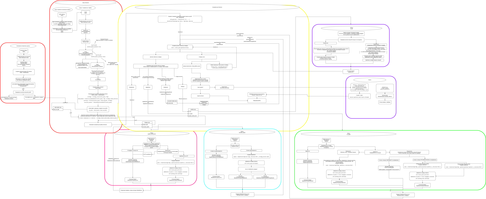

# Market Bots

Cобытийно-ориентированный фреймворк на Python для разработки, бэктестинга и (в будущем) запуска алгоритмических торговых стратегий в sandbox и live режимах на Tinkoff бирже (возможно на криптобиржах)

## О проекте
Предназначен для проверки торговых идей на исторических данных.

**Текущие возможности:**
*   **Базовый бэктестер:** Базовая симуляция работы стратегии на исторических данных свеча за свечой.
*   **Работа с локальными данными:** Бэктест проводится на предварительно скачанных данных.
*   **Возможность скачивания исторических данных** Скачивание происходит через API Tinkoff
*   **Гибкое управление риском:** Поддержка нескольких моделей расчета стоп-лосса, тейк-профита и размера позиции:
    *   **FIXED:** На основе фиксированного процента от капитала.
    *   **ATR:** На основе волатильности (индикатор Average True Range).
*   **Возможность добавления стратегий:** Добавление новых стратегий созданием файла с новым классом, наследующим абстрактный базовый класса.
*   **Базовый анализ:** Генерация отчетов с ключевыми метриками (PnL, Win Rate, Max Drawdown и др.) и графиком капитала.
*   **Массовое тестирование:** Возможность запуска одной стратегии сразу на множестве скачанных инструментов.

## Архитектура

Основной принцип работы фреймворка — разделение логики на независимые компоненты, которые общаются через центральную очередь событий.



## Быстрый старт

**Требования:** Python 3.12.10 (тестировалось на этой версии).

### 1. Установка

```bash
# 1. Клонировать репозиторий
git clone https://github.com/UseUseless/market_bots.git
cd market_bots

# 2. Создать и активировать виртуальное окружение
python -m venv .venv
# Для Linux/MacOS:
source .venv/bin/activate
# Для Windows:
# .venv\Scripts\activate

# 3. Установить зависимости
pip install -r requirements.txt
```

### 2. Конфигурация

1.  Скопируйте файл `.env.example` и переименуйте его в `.env`.
2.  Откройте файл `.env` и вставьте свой `TINKOFF_TOKEN_READONLY` для скачивания данных с Tinkoff.


## Порядок работы

### Шаг 1: Настройка параметров (config.py)

Все основные настройки находятся в файле `config.py`. **Перед началом работы откройте этот файл и настройте его под себя.**

### Шаг 2: Работа с лаунчером

Проект теперь управляется через удобный интерактивный лаунчер. Он является единой точкой входа для всех операций.

**Чтобы запустить, выполните команду:**
```bash
python launcher.py
```

После запуска вы увидите меню, где сможете выбрать желаемое действие:

*   **Скачать исторические данные:** Скрипт пошагово спросит биржу, тикеры, интервал и период для загрузки.
*   **Запустить бэктест на одном инструменте:** Лаунчер автоматически найдет скачанные данные и предложит выбрать инструмент для теста.
*   **Запустить массовый бэктест:** Позволяет протестировать стратегию сразу на всех доступных инструментах для выбранного интервала.
*   **Проанализировать результаты (Dashboard):** Запускает интерактивную веб-панель для визуального анализа всех проведенных бэктестов.
*   **Выход:** Завершить работу.

> **Примечание:** Старые скрипты (`download_data.py`, `run.py` и др.) по-прежнему можно запускать напрямую с аргументами командной строки, если это необходимо для автоматизации или тестирования.

### Шаг 3: Создание своей стратегии

1.  Создайте Python-файл в папке `strategies/`.
2.  Создайте в нем класс, наследуемый от `BaseStrategy`.
3.  Добавьте секцию для вашей стратегии в `STRATEGY_CONFIG` в файле `config.py`.
4.  Реализуйте обязательные свойства и методы, считывая параметры из конфига.

    *   **Свойства:** `@property` для `candle_interval`, `stop_loss_percent`, `take_profit_percent`.
    *   **Методы:** `prepare_data` (расчет индикаторов) и `calculate_signals` (торговая логика).

5.  Импортируйте и зарегистрируйте свою стратегию в `AVAILABLE_STRATEGIES` в файле `run.py`.


## Результаты работы

Папки для результатов настраиваются в `PATH_CONFIG` в файле `config.py`. По умолчанию:

*   `data/`: Скачанные исторические данные.
*   `logs/`: Логи выполнения (`_run.log`) и сделок (`_trades.csv`).
*   `reports/`: Графические отчеты (`.png`).

## Кастомизация анализа

Логика расчета метрик и построения графика находится в файле `analyzer.py`. Вы можете изменить или добавить новые метрики в методе `calculate_metrics` класса `SingleRunAnalyzer`.

### Также для базовой проверки стратегии добавлен расчет стратегии "Buy and Hold".

Для чего она? 
Отвечает на вопрос: "Наша стратегия оказалась лучше, чем просто владение этим активом (закупиться на весь капитал в первый день)?"

Выявляет "пустые" стратегии: Если твоя сложная стратегия с десятком индикаторов и ML-моделью по итогу заработала 15%, а простое владение активом за тот же период принесло 30%, то твоя стратегия неэффективна. Она не создает дополнительной ценности (альфы).

Дает контекст: Помогает понять, была ли прибыль результатом гениальности стратегии или просто весь рынок рос (и любая покупка принесла бы деньги).