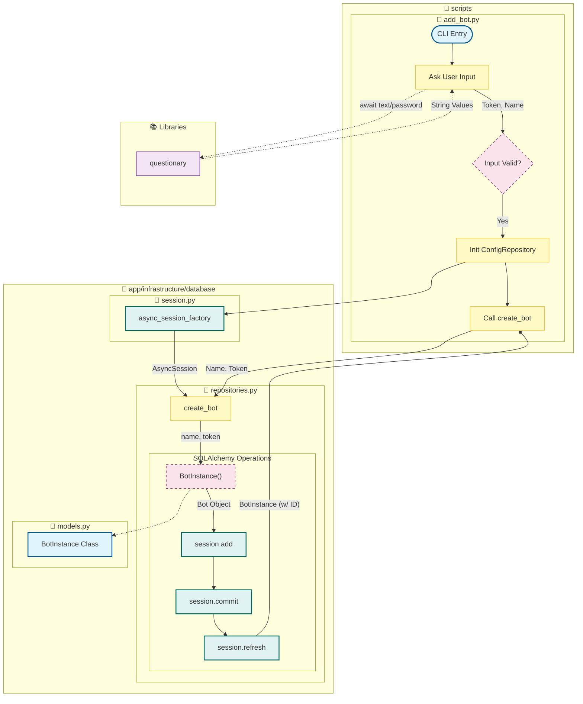

```mermaid
flowchart TB
    %% --- STYLES ---
    classDef file fill:#e1f5fe,stroke:#01579b,stroke-width:2px;
    classDef folder fill:#fff3e0,stroke:#e65100,stroke-width:2px,stroke-dasharray: 5 5;
    classDef func fill:#fff9c4,stroke:#fbc02d,stroke-width:1px;
    classDef logic fill:#fce4ec,stroke:#880e4f,stroke-width:1px,stroke-dasharray: 5 5;
    classDef db fill:#e0f2f1,stroke:#00695c,stroke-width:2px;
    classDef lib fill:#f3e5f5,stroke:#7b1fa2,stroke-width:1px;

    %% --- 1. ENTRY POINT ---
    subgraph F_SCRIPTS ["📂 scripts"]
        direction TB
        subgraph S_ADD ["📄 add_bot.py"]
            direction TB
            Entry([CLI Entry]):::file
            AskInput[Ask User Input]:::func
            CheckInput{"Input Valid?"}:::logic
            InitRepo[Init ConfigRepository]:::func
            CallCreate[Call create_bot]:::func
            
            Entry --> AskInput
            AskInput -->|"Token, Name"| CheckInput
            CheckInput -- Yes --> InitRepo
            InitRepo --> CallCreate
        end
    end

    %% --- 2. EXTERNAL LIB ---
    subgraph LIB ["📚 Libraries"]
        direction TB
        Quest[questionary]:::lib
        AskInput -.->|await text/password| Quest
        Quest -.->|"String Values"| AskInput
    end

    %% --- 3. DATABASE INFRASTRUCTURE ---
    subgraph F_DB ["📂 app/infrastructure/database"]
        direction TB
        
        subgraph S_SESSION ["📄 session.py"]
            direction TB
            SessionCtx[async_session_factory]:::db
        end

        subgraph S_REPO ["📄 repositories.py"]
            direction TB
            RepoCreate[create_bot]:::func
            
            subgraph ORM_OPS ["SQLAlchemy Operations"]
                direction TB
                Instantiate["BotInstance()"]:::logic
                DbAdd[session.add]:::db
                DbCommit[session.commit]:::db
                DbRefresh[session.refresh]:::db
            end
            
            RepoCreate -->|"name, token"| Instantiate
            Instantiate -->|"Bot Object"| DbAdd
            DbAdd --> DbCommit
            DbCommit --> DbRefresh
        end
        
        subgraph S_MODELS ["📄 models.py"]
            direction TB
            ModelDef[BotInstance Class]:::file
            Instantiate -.-> ModelDef
        end
    end

    %% --- DATA FLOW CONNECTIONS ---
    
    %% Session Management
    InitRepo --> SessionCtx
    SessionCtx -->|AsyncSession| RepoCreate
    
    %% Creation Flow
    CallCreate -->|"Name, Token"| RepoCreate
    
    %% Result Flow
    DbRefresh -->|"BotInstance (w/ ID)"| CallCreate
```