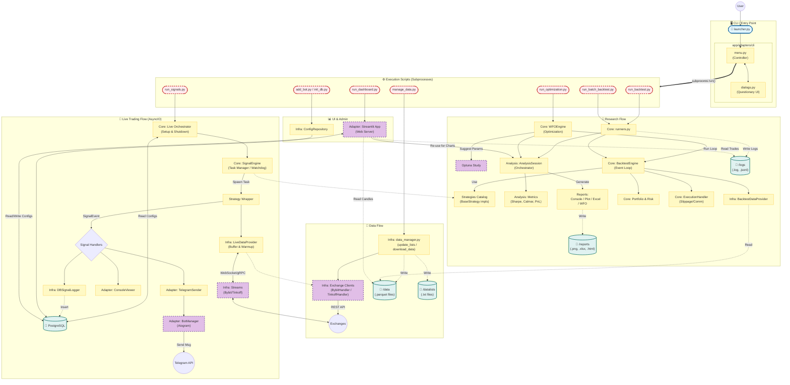

```mermaid
flowchart TD
    %% ==========================================
    %% 1. СТИЛИ (LEGEND)
    %% ==========================================
    classDef file fill:#e1f5fe,stroke:#01579b,stroke-width:2px;
    classDef logic fill:#fff9c4,stroke:#fbc02d,stroke-width:1px;
    classDef ext fill:#e1bee7,stroke:#4a148c,stroke-width:2px,stroke-dasharray: 5 5;
    classDef db fill:#e0f2f1,stroke:#00695c,stroke-width:2px;
    classDef subprocess fill:#ffebee,stroke:#c62828,stroke-width:2px,stroke-dasharray: 5 5;

    User((User)) 
    
    %% ==========================================
    %% 2. CLI LAYER (LAUNCHER)
    %% ==========================================
    subgraph CLI_LAYER ["🖥️ CLI / Entry Point"]
        Launcher(["🚀 launcher.py"]):::file
        
        subgraph AdaptersCLI ["app/adapters/cli"]
            Menu["menu.py
            (Controller)"]:::logic
            Dialogs["dialogs.py
            (Questionary UI)"]:::logic
        end
    end

    User --> Launcher
    Launcher --> Menu
    Menu <--> Dialogs

    %% ==========================================
    %% 3. ПРОЦЕССЫ (SCRIPTS)
    %% ==========================================
    %% Меню запускает скрипты как подпроцессы
    Menu =="subprocess.run()"==> SCRIPTS_POOL

    subgraph SCRIPTS_POOL ["⚙️ Execution Scripts (Subprocesses)"]
        direction TB
        S_Data(["manage_data.py"]):::subprocess
        S_Back(["run_backtest.py"]):::subprocess
        S_Batch(["run_batch_backtest.py"]):::subprocess
        S_Optim(["run_optimization.py"]):::subprocess
        S_Live(["run_signals.py"]):::subprocess
        S_Dash(["run_dashboard.py"]):::subprocess
        S_Admin(["add_bot.py / init_db.py"]):::subprocess
    end

    %% ==========================================
    %% 4. ПОТОК ДАННЫХ (DATA MANAGEMENT)
    %% ==========================================
    subgraph FLOW_DATA ["💾 Data Flow"]
        direction TB
        S_Data --> DataMgr["Infra: data_manager.py
        (update_lists / download_data)"]:::logic
        
        DataMgr --> ExClients["Infra: Exchange Clients
        (BybitHandler / TinkoffHandler)"]:::ext
        
        ExClients -- "REST API" --> ExternalExchanges((Exchanges))
        
        DataMgr -.->|Write| FS_Parquet[("📂 /data
        (.parquet files)")]:::db
        DataMgr -.->|Write| FS_Lists[("📂 /datalists
        (.txt files)")]:::db
    end

    %% ==========================================
    %% 5. ИССЛЕДОВАНИЯ (BACKTEST & OPTIMIZATION)
    %% ==========================================
    subgraph FLOW_RESEARCH ["🧪 Research Flow"]
        direction TB
        
        %% Общие компоненты ядра
        StrategyLib["Strategies Catalog
        (BaseStrategy impls)"]:::logic
        MetricsCalc["Analysis: Metrics
        (Sharpe, Calmar, PnL)"]:::logic

        %% Ветка Оптимизации
        S_Optim --> WFO_Eng["Core: WFOEngine
        (Optimization)"]:::logic
        WFO_Eng -- "Suggest Params" --> Optuna["Optuna Study"]:::ext
        WFO_Eng -- "Run Loop" --> BT_Engine

        %% Ветка Бэктеста
        S_Back & S_Batch --> BT_Runners["Core: runners.py"]:::logic
        BT_Runners --> BT_Engine["Core: BacktestEngine
        (Event Loop)"]:::logic

        %% Внутрянка Бэктеста
        BT_Engine --> BT_Feed["Infra: BacktestDataProvider"]:::logic
        BT_Engine --> Portfolio["Core: Portfolio & Risk"]:::logic
        BT_Engine --> ExecSim["Core: ExecutionHandler
        (Slippage/Comm)"]:::logic
        
        BT_Engine -- "Use" --> StrategyLib
        BT_Feed -.->|Read| FS_Parquet

        %% Аналитика и отчеты
        BT_Runners & WFO_Eng --> AnalysisSes["Analysis: AnalysisSession
        (Orchestrator)"]:::logic
        AnalysisSes --> MetricsCalc
        
        AnalysisSes -- "Generate" --> ReportsGen["Reports:
        Console / Plot / Excel / WFO"]:::logic
        
        ReportsGen -.->|Write| FS_Reports[("📂 /reports
        (.png, .xlsx, .html)")]:::db
        BT_Runners -.->|Write Logs| FS_Logs[("📂 /logs
        (.log, .jsonl)")]:::db
    end

    %% ==========================================
    %% 6. LIVE ТОРГОВЛЯ (ASYNC)
    %% ==========================================
    subgraph FLOW_LIVE ["📡 Live Trading Flow (AsyncIO)"]
        direction TB
        
        S_Live --> LiveOrch["Core: Live Orchestrator
        (Setup & Shutdown)"]:::logic
        
        LiveOrch --> SignalEng["Core: SignalEngine
        (Task Manager / Watchdog)"]:::logic
        
        %% Связь с БД (Конфиги)
        LiveOrch <-->|Read Configs| DB_Postgres[("🐘 PostgreSQL")]:::db
        
        %% Поток данных Live
        SignalEng -- "Spawn Task" --> StrategyWrap["Strategy Wrapper"]:::logic
        StrategyWrap --> LiveFeed["Infra: LiveDataProvider
        (Buffer & Warmup)"]:::logic
        LiveFeed <-->|WebSocket/gRPC| StreamClients["Infra: Streams
        (Bybit/Tinkoff)"]:::ext
        StreamClients <--> ExternalExchanges
        
        %% Обработка сигналов
        StrategyWrap -- "SignalEvent" --> Handlers{Signal Handlers}
        
        Handlers --> H_Tele["Adapter: TelegramSender"]:::logic
        Handlers --> H_DB["Infra: DBSignalLogger"]:::logic
        Handlers --> H_Console["Adapter: ConsoleViewer"]:::logic
        
        H_Tele --> BotMgr["Adapter: BotManager
        (Aiogram)"]:::ext
        BotMgr -- "Send Msg" --> TelegramAPI((Telegram API))
        H_DB -.->|Insert| DB_Postgres
    end

    %% ==========================================
    %% 7. UI & ADMIN
    %% ==========================================
    subgraph FLOW_UI ["📊 UI & Admin"]
        direction TB
        
        S_Admin --> RepoConfig["Infra: ConfigRepository"]:::logic
        RepoConfig --> DB_Postgres
        
        S_Dash --> StreamlitApp["Adapter: Streamlit App
        (Web Server)"]:::ext
        
        %% Дашборд читает из всех источников
        StreamlitApp <-->|Read/Write Configs| DB_Postgres
        StreamlitApp -.->|Read Trades| FS_Logs
        StreamlitApp -.->|Read Candles| FS_Parquet
        
        %% Переиспользование логики анализа в Дашборде
        StreamlitApp -- "Re-use for Charts" --> AnalysisSes
    end

    %% ==========================================
    %% СВЯЗИ МЕЖДУ ПОДСИСТЕМАМИ
    %% ==========================================
    %% Стратегии используются и в Live
    SignalEng -.-> StrategyLib
    %% LiveFeed использует ExClients для разогрева
    LiveFeed -.-> ExClients
```