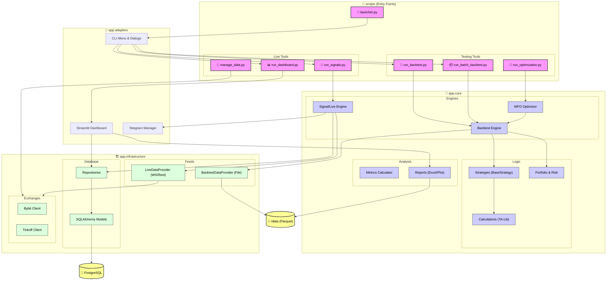

```mermaid
flowchart TB
    %% --- STYLES ---
    classDef script fill:#f9f,stroke:#333,stroke-width:2px,color:black;
    classDef core fill:#ccf,stroke:#333,stroke-width:1px,color:black;
    classDef infra fill:#dfd,stroke:#333,stroke-width:1px,color:black;
    classDef storage fill:#ff9,stroke:#333,stroke-width:2px,color:black;

    %% --- 1. ENTRY POINTS (SCRIPTS) ---
    subgraph SCRIPTS_DIR ["📂 scripts (Entry Points)"]
        direction TB
        LAUNCHER["🚀 launcher.py"]:::script
        
        subgraph BACKTEST_TOOLS ["Testing Tools"]
            direction LR
            BT_SINGLE["🧪 run_backtest.py"]:::script
            BT_BATCH["📦 run_batch_backtest.py"]:::script
            BT_OPT["🧬 run_optimization.py"]:::script
        end

        subgraph LIVE_TOOLS ["Live Tools"]
            direction LR
            LIVE_SIG["📡 run_signals.py"]:::script
            DASH["📊 run_dashboard.py"]:::script
            MANAGE["💾 manage_data.py"]:::script
        end
    end

    %% --- 2. ADAPTERS ---
    subgraph ADAPTERS ["🔌 app.adapters"]
        CLI["CLI Menu & Dialogs"]
        STREAMLIT["Streamlit Dashboard"]
        TG_BOT["Telegram Manager"]
    end

    %% --- 3. CORE (BUSINESS LOGIC) ---
    subgraph CORE ["🧠 app.core"]
        direction TB
        
        subgraph ENGINES ["Engines"]
            ENG_BT["Backtest Engine"]:::core
            ENG_LIVE["Signal/Live Engine"]:::core
            ENG_OPT["WFO Optimizer"]:::core
        end

        subgraph LOGIC ["Logic"]
            STRATS["Strategies (BaseStrategy)"]:::core
            PORTFOLIO["Portfolio & Risk"]:::core
            CALCS["Calculations (TA-Lib)"]:::core
        end
        
        subgraph ANALYSIS ["Analysis"]
            METRICS["Metrics Calculator"]:::core
            REPORTS["Reports (Excel/Plot)"]:::core
        end
    end

    %% --- 4. INFRASTRUCTURE ---
    subgraph INFRA ["🏗️ app.infrastructure"]
        direction TB
        
        subgraph FEEDS ["Feeds"]
            FEED_LIVE["LiveDataProvider (WS/Rest)"]:::infra
            FEED_BT["BacktestDataProvider (File)"]:::infra
        end
        
        subgraph DB_LAYER ["Database"]
            REPO["Repositories"]:::infra
            MODELS["SQLAlchemy Models"]:::infra
        end

        subgraph EXCHANGES ["Exchanges"]
            BYBIT["Bybit Client"]:::infra
            TINKOFF["Tinkoff Client"]:::infra
        end
    end

    %% --- 5. STORAGE ---
    DATABASE[("🐘 PostgreSQL")]:::storage
    FILES[("📂 /data (Parquet)")]:::storage

    %% --- CONNECTIONS ---
    
    %% Launcher Flow
    LAUNCHER --> CLI
    CLI --> BT_SINGLE
    CLI --> BT_BATCH
    CLI --> LIVE_SIG
    CLI --> DASH

    %% Script Execution Flow
    BT_SINGLE --> ENG_BT
    BT_BATCH --> ENG_BT
    BT_OPT --> ENG_OPT
    LIVE_SIG --> ENG_LIVE
    MANAGE --> EXCHANGES

    %% Engine Dependencies
    ENG_BT --> FEED_BT
    ENG_BT --> STRATS
    ENG_BT --> PORTFOLIO
    
    ENG_LIVE --> FEED_LIVE
    ENG_LIVE --> TG_BOT
    ENG_LIVE --> REPO
    
    ENG_OPT --> ENG_BT
    
    %% Data Flow
    FEED_BT --> FILES
    FEED_LIVE --> EXCHANGES
    
    %% Strategy Dependencies
    STRATS --> CALCS
    
    %% DB Flow
    REPO --> MODELS
    MODELS --> DATABASE
    
    %% Dashboard Flow
    DASH --> STREAMLIT
    STREAMLIT --> REPO
    STREAMLIT --> REPORTS
    REPORTS --> FILES
```