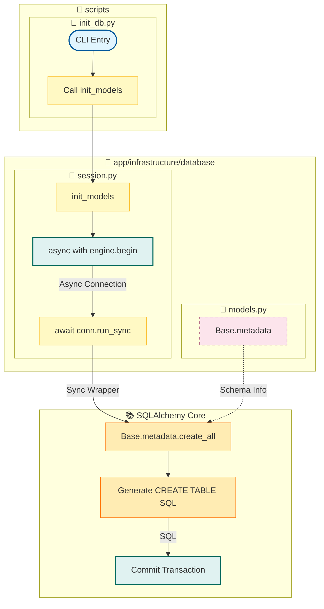

```mermaid
flowchart TB
    %% --- STYLES ---
    classDef file fill:#e1f5fe,stroke:#01579b,stroke-width:2px;
    classDef folder fill:#fff3e0,stroke:#e65100,stroke-width:2px,stroke-dasharray: 5 5;
    classDef func fill:#fff9c4,stroke:#fbc02d,stroke-width:1px;
    classDef logic fill:#fce4ec,stroke:#880e4f,stroke-width:1px,stroke-dasharray: 5 5;
    classDef db fill:#e0f2f1,stroke:#00695c,stroke-width:2px;
    classDef internal fill:#ffecb3,stroke:#ff6f00,stroke-width:1px;

    %% --- 1. ENTRY POINT ---
    subgraph F_SCRIPTS ["📂 scripts"]
        direction TB
        subgraph S_INIT ["📄 init_db.py"]
            direction TB
            Entry([CLI Entry]):::file
            CallInit[Call init_models]:::func
            
            Entry --> CallInit
        end
    end

    %% --- 2. DATABASE INFRASTRUCTURE ---
    subgraph F_DB ["📂 app/infrastructure/database"]
        direction TB
        
        subgraph S_MODELS ["📄 models.py"]
            direction TB
            SchemaDef[Base.metadata]:::logic
            %% Это источник истины о структуре таблиц
        end

        subgraph S_SESSION ["📄 session.py"]
            direction TB
            InitModels[init_models]:::func
            EngineBegin[async with engine.begin]:::db
            RunSync[await conn.run_sync]:::func
            
            InitModels --> EngineBegin
            EngineBegin -->|Async Connection| RunSync
        end
    end

    %% --- 3. SQLALCHEMY INTERNAL ---
    subgraph LIB_SA ["📚 SQLAlchemy Core"]
        direction TB
        CreateAll[Base.metadata.create_all]:::internal
        GenerateDDL[Generate CREATE TABLE SQL]:::internal
        CommitDB[Commit Transaction]:::db
        
        RunSync -->|Sync Wrapper| CreateAll
        CreateAll --> GenerateDDL
        GenerateDDL -->|SQL| CommitDB
    end

    %% --- CROSS-GRAPH CONNECTIONS ---
    %% Выносим длинные связи вниз для чистоты
    
    CallInit --> InitModels
    SchemaDef -.->|Schema Info| CreateAll
```