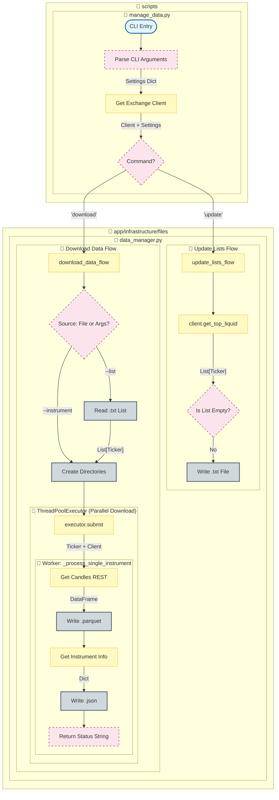

```mermaid
flowchart TB
    %% --- STYLES ---
    classDef file fill:#e1f5fe,stroke:#01579b,stroke-width:2px;
    classDef folder fill:#fff3e0,stroke:#e65100,stroke-width:2px,stroke-dasharray: 5 5;
    classDef func fill:#fff9c4,stroke:#fbc02d,stroke-width:1px;
    classDef logic fill:#fce4ec,stroke:#880e4f,stroke-width:1px,stroke-dasharray: 5 5;
    classDef loop fill:#e8f5e9,stroke:#2e7d32,stroke-width:2px;
    classDef thread fill:#d1c4e9,stroke:#512da8,stroke-width:2px;
    classDef io fill:#cfd8dc,stroke:#455a64,stroke-width:2px;

    %% --- 1. ENTRY POINT ---
    subgraph F_SCRIPTS ["📂 scripts"]
        direction TB
        subgraph S_RUN ["📄 manage_data.py"]
            direction TB
            Entry([CLI Entry]):::file
            ParseArgs[Parse CLI Arguments]:::logic
            GetClient[Get Exchange Client]:::func
            CheckCommand{"Command?"}:::logic
            
            Entry --> ParseArgs
            ParseArgs -->|Settings Dict| GetClient
            GetClient -->|Client + Settings| CheckCommand
        end
    end

    %% --- 2. DATA MANAGER LOGIC ---
    subgraph F_INFRA ["📂 app/infrastructure/files"]
        direction TB
        subgraph S_DM ["📄 data_manager.py"]
            direction TB
            
            %% BRANCH: UPDATE LISTS
            subgraph FLOW_UPDATE ["🌊 Update Lists Flow"]
                direction TB
                UpdateFunc[update_lists_flow]:::func
                GetTop[client.get_top_liquid]:::func
                CheckEmpty{"Is List Empty?"}:::logic
                SaveTxt[Write .txt File]:::io
                
                UpdateFunc --> GetTop
                GetTop -->|"List[Ticker]"| CheckEmpty
                CheckEmpty -- No --> SaveTxt
            end

            %% BRANCH: DOWNLOAD DATA
            subgraph FLOW_DOWNLOAD ["🌊 Download Data Flow"]
                direction TB
                DownloadFunc[download_data_flow]:::func
                ResolveList{"Source: File or Args?"}:::logic
                ReadList[Read .txt List]:::io
                CreateDirs[Create Directories]:::io
                
                subgraph PARALLEL ["🧵 ThreadPoolExecutor (Parallel Download)"]
                    direction TB
                    SubmitTask[executor.submit]:::func
                    
                    subgraph WORKER ["👷 Worker: _process_single_instrument"]
                        direction TB
                        
                        %% Step 1: Candles
                        FetchCandles[Get Candles REST]:::func
                        SaveParquet[Write .parquet]:::io
                        
                        %% Step 2: Meta
                        FetchInfo[Get Instrument Info]:::func
                        SaveJson[Write .json]:::io
                        
                        ReturnStatus[Return Status String]:::logic
                    end
                end
                
                DownloadFunc --> ResolveList
                ResolveList -- "--list" --> ReadList
                ResolveList -- "--instrument" --> CreateDirs
                ReadList -->|"List[Ticker]"| CreateDirs
                
                CreateDirs --> SubmitTask
                SubmitTask -->|Ticker + Client| FetchCandles
                
                FetchCandles -->|DataFrame| SaveParquet
                SaveParquet --> FetchInfo
                FetchInfo -->|Dict| SaveJson
                SaveJson --> ReturnStatus
            end
        end
    end

    %% --- CONNECTIONS ---
    CheckCommand -->|'update'| UpdateFunc
    CheckCommand -->|'download'| DownloadFunc
```