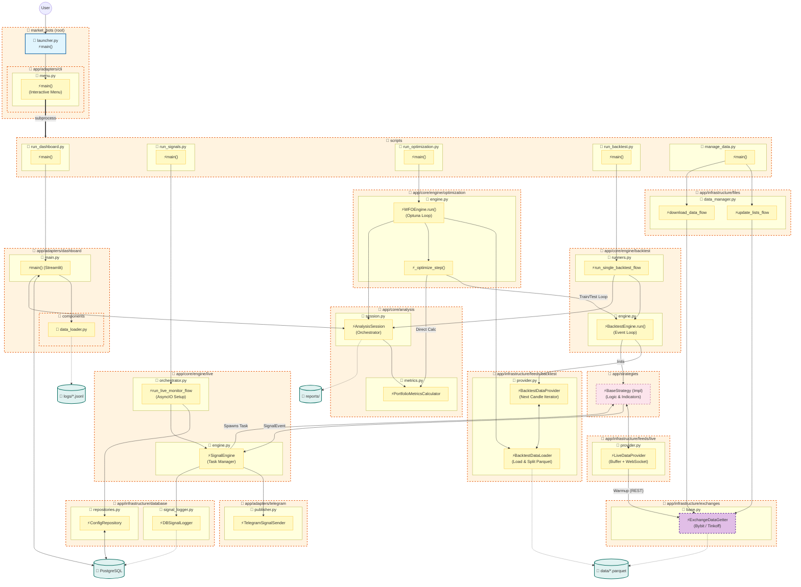

```mermaid
flowchart TD
    %% ==========================================
    %% 1. СТИЛИ
    %% ==========================================
    classDef folder fill:#fff3e0,stroke:#e65100,stroke-width:2px,stroke-dasharray: 5 5;
    classDef file fill:#e1f5fe,stroke:#01579b,stroke-width:2px;
    classDef func fill:#fff9c4,stroke:#fbc02d,stroke-width:1px;
    classDef ext fill:#e1bee7,stroke:#4a148c,stroke-width:2px,stroke-dasharray: 5 5;
    classDef logic fill:#fce4ec,stroke:#880e4f,stroke-width:1px,stroke-dasharray: 5 5;
    classDef db fill:#e0f2f1,stroke:#00695c,stroke-width:2px;

    %% ==========================================
    %% 2. ТОЧКА ВХОДА
    %% ==========================================
    subgraph Root ["📂 market_bots (root)"]
        LauncherFile["📄 launcher.py
        ⚡main()"]:::file
        
        subgraph AdaptersCLI ["📂 app/adapters/cli"]
            subgraph MenuFile ["📄 menu.py"]
                MenuCtrl["⚡main()
                (Interactive Menu)"]:::func
            end
        end
    end

    User((User)) --> LauncherFile
    LauncherFile --> MenuCtrl

    %% ==========================================
    %% 3. СКРИПТЫ
    %% ==========================================
    MenuCtrl =="subprocess"==> ScriptsFolder

    subgraph ScriptsFolder ["📂 scripts"]
        direction TB
        subgraph S_Manage ["📄 manage_data.py"]
            ManageEntry["⚡main()"]:::func
        end
        subgraph S_Back ["📄 run_backtest.py"]
            BackEntry["⚡main()"]:::func
        end
        subgraph S_Optim ["📄 run_optimization.py"]
            OptimEntry["⚡main()"]:::func
        end
        subgraph S_Live ["📄 run_signals.py"]
            LiveEntry["⚡main()"]:::func
        end
        subgraph S_Dash ["📄 run_dashboard.py"]
            DashEntry["⚡main()"]:::func
        end
    end

    %% ==========================================
    %% 4. ИНФРАСТРУКТУРА ДАННЫХ (DATA & FEEDS)
    %% ==========================================
    subgraph InfraFiles ["📂 app/infrastructure/files"]
        subgraph DataMgrFile ["📄 data_manager.py"]
            UpdateFlow["⚡update_lists_flow"]:::func
            DownFlow["⚡download_data_flow"]:::func
        end
    end

    subgraph InfraExchanges ["📂 app/infrastructure/exchanges"]
        subgraph BaseExFile ["📄 base.py"]
            ExClient["⚡ExchangeDataGetter
            (Bybit / Tinkoff)"]:::ext
        end
    end

    subgraph InfraBackFeeds ["📂 app/infrastructure/feeds/backtest"]
        subgraph BTProvFile ["📄 provider.py"]
            BTLoader["⚡BacktestDataLoader
            (Load & Split Parquet)"]:::func
            BTFeed["⚡BacktestDataProvider
            (Next Candle Iterator)"]:::func
        end
    end

    subgraph InfraLiveFeeds ["📂 app/infrastructure/feeds/live"]
        subgraph LiveProvFile ["📄 provider.py"]
            LiveProv["⚡LiveDataProvider
            (Buffer + WebSocket)"]:::func
        end
    end

    %% Связи Data Flow
    ManageEntry --> UpdateFlow & DownFlow
    UpdateFlow & DownFlow --> ExClient
    ExClient -.-> FS_Parquet[("📂 data/*.parquet")]:::db
    
    %% Чтение данных
    BTLoader -.-> FS_Parquet
    LiveProv -- "Warmup (REST)" --> ExClient

    %% ==========================================
    %% 5. ОБЩЕЕ ЯДРО (СТРАТЕГИИ И МЕТРИКИ)
    %% ==========================================
    subgraph StrategiesFolder ["📂 app/strategies"]
        StrategyClass["⚡BaseStrategy (Impl)
        (Logic & Indicators)"]:::logic
    end

    subgraph CoreAnalysis ["📂 app/core/analysis"]
        subgraph SessionFile ["📄 session.py"]
            AnalSession["⚡AnalysisSession
            (Orchestrator)"]:::func
        end
        subgraph MetricsFile ["📄 metrics.py"]
            CalcMetrics["⚡PortfolioMetricsCalculator"]:::func
        end
    end

    %% ==========================================
    %% 6. ДВИЖКИ БЭКТЕСТА И ОПТИМИЗАЦИИ
    %% ==========================================
    subgraph CoreBacktest ["📂 app/core/engine/backtest"]
        subgraph RunnersFile ["📄 runners.py"]
            RunSingle["⚡run_single_backtest_flow"]:::func
        end
        subgraph EngineFile ["📄 engine.py"]
            BTEngine["⚡BacktestEngine.run()
            (Event Loop)"]:::func
        end
    end

    subgraph CoreOptim ["📂 app/core/engine/optimization"]
        subgraph WFOFile ["📄 engine.py"]
            WFOEngine["⚡WFOEngine.run()
            (Optuna Loop)"]:::func
            OptimizeStep["⚡_optimize_step()"]:::func
        end
    end

    %% Связи Бэктеста
    BackEntry --> RunSingle
    RunSingle --> BTEngine
    BTEngine --> BTFeed
    BTFeed <--> BTLoader
    
    %% Важно: Engine создает экземпляры стратегий
    BTEngine -- "Inits" --> StrategyClass
    
    %% Отчеты Бэктеста
    RunSingle --> AnalSession
    AnalSession --> CalcMetrics
    AnalSession -.-> FS_Reports[("📂 reports/")]:::db

    %% Связи Оптимизации
    OptimEntry --> WFOEngine
    WFOEngine --> BTLoader
    WFOEngine --> OptimizeStep
    OptimizeStep -- "Train/Test Loop" --> BTEngine
    
    %% Прямой расчет метрик в цикле (Optimization Phase)
    OptimizeStep -- "Direct Calc" --> CalcMetrics
    %% Финальный отчет
    WFOEngine --> AnalSession

    %% ==========================================
    %% 7. LIVE TRADING CORE
    %% ==========================================
    subgraph CoreLive ["📂 app/core/engine/live"]
        subgraph OrchFile ["📄 orchestrator.py"]
            LiveOrch["⚡run_live_monitor_flow
            (AsyncIO Setup)"]:::func
        end
        subgraph SignalEngFile ["📄 engine.py"]
            SigEngine["⚡SignalEngine
            (Task Manager)"]:::func
        end
    end

    subgraph AdaptersTg ["📂 app/adapters/telegram"]
        subgraph PubFile ["📄 publisher.py"]
            TgSender["⚡TelegramSignalSender"]:::func
        end
    end

    subgraph InfraDB ["📂 app/infrastructure/database"]
        subgraph ReposFile ["📄 repositories.py"]
            ConfigRepo["⚡ConfigRepository"]:::func
        end
        subgraph LogFile ["📄 signal_logger.py"]
            DBLogger["⚡DBSignalLogger"]:::func
        end
    end

    %% Связи Live
    LiveEntry --> LiveOrch
    LiveOrch --> ConfigRepo
    ConfigRepo <--> DB_Postgres[("🐘 PostgreSQL")]:::db
    
    LiveOrch --> SigEngine
    SigEngine -- "Spawns Task" --> StrategyClass
    StrategyClass <--> LiveProv
    
    %% Поток сигналов
    StrategyClass -- "SignalEvent" --> SigEngine
    SigEngine --> TgSender & DBLogger
    DBLogger -.-> DB_Postgres

    %% ==========================================
    %% 8. DASHBOARD
    %% ==========================================
    subgraph AdaptDash ["📂 app/adapters/dashboard"]
        subgraph DashMain ["📄 main.py"]
            StreamlitEntry["⚡main() (Streamlit)"]:::func
        end
        subgraph DashComps ["📂 components"]
            DataLoader["📄 data_loader.py"]:::func
        end
    end

    DashEntry --> StreamlitEntry
    StreamlitEntry --> DataLoader
    DataLoader -.-> FS_Logs[("📂 logs/*.jsonl")]:::db
    StreamlitEntry <--> DB_Postgres
    
    %% Дашборд использует ядро аналитики для пересчета на лету
    StreamlitEntry --> AnalSession

    %% ==========================================
    %% 9. СТИЛИ ПАПОК
    %% ==========================================
    class Root,AdaptersCLI,ScriptsFolder,InfraData,InfraFiles,InfraExchanges,CoreBacktest,CoreOptim,CoreAnalysis,CoreLive,InfraBackFeeds,InfraLiveFeeds,StrategiesFolder,InfraDB,AdaptersTg,AdaptDash,DashComps folder;
```