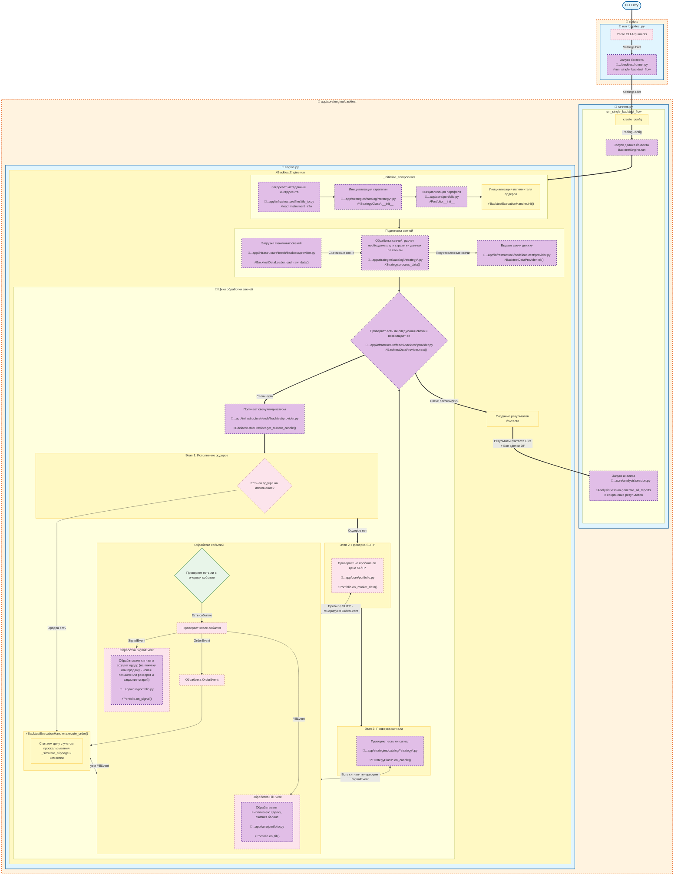

```mermaid
flowchart TB
    %% --- 1. СТИЛИ ---
    classDef folder fill:#fff3e0,stroke:#e65100,stroke-width:2px,stroke-dasharray: 5 5;
    classDef file fill:#e1f5fe,stroke:#01579b,stroke-width:2px;
    classDef func fill:#fff9c4,stroke:#fbc02d,stroke-width:1px;
    classDef ext fill:#e1bee7,stroke:#4a148c,stroke-width:2px,stroke-dasharray: 5 5;
    classDef logic fill:#fce4ec,stroke:#880e4f,stroke-width:1px,stroke-dasharray: 5 5;
    classDef loop fill:#e8f5e9,stroke:#2e7d32,stroke-width:2px;

    %% --- 2. СТРУКТУРА ---
    Entry([CLI Entry]):::file
    %% Папка scripts
    subgraph SCRIPTS ["📂 scripts"]
        direction LR
        subgraph RUN ["📄 run_backtest.py"]
            direction LR
            ParseArgs[Parse CLI Arguments]:::logic
            RunSingleBackExt["Запуск бэктеста
            📄.../backtest/runner.py
            ⚡run_single_backtest_flow"]:::ext
        end
    end
    
    %% Папка app/core/engine/backtest
    subgraph CoreEngine ["📂 app/core/engine/backtest"]
    direction LR
        subgraph S_RUNNERS ["📄 runners.py"]
            subgraph RunSingleBacktest [run_single_backtest_flow]
                direction LR
                Config[_create_config]:::func
                RunBackEngine[Запуск движка бэктеста BacktestEngine.run]:::ext
                GenerateReports["Запуск анализа
                📄...core\analysis\session.py
                ⚡AnalysisSession.generate_all_reports и сохранение результатов"]:::ext
            end
        end

        subgraph ENGINE ["📄 engine.py"]
        direction LR
            subgraph BacktestRun [⚡BacktestEngine.run]
            direction LR
                subgraph InitComponents [_initialize_components]
                    direction LR
                    LoadData["Загружает метаданные инструмента
                📄...app\infrastructure\files\file_io.py
                ⚡load_instrument_info"]:::ext
                    InitStrategy["Инициализация стратегии
                📄...app/strategies/catalog/*strategy*.py
                ⚡*StrategyClass*.__init__"]:::ext
                    InitPortfolio["Инициализация портфеля
                📄...app/core/portfolio.py
                ⚡Portfolio.__init__"]:::ext
                    InitBacktestExecutionHandler["Инициализация исполнителя ордеров
                ⚡BacktestExecutionHandler.init()"]:::func
                end

                subgraph PrepareData["Подготовка свечей"]
                    direction LR
                    RunDataLoader["Загрузка скачанных свечей
                📄...app\infrastructure\feeds\backtest\provider.py
                ⚡BacktestDataLoader.load_raw_data()"]:::ext
                
                    EnrichData["Обработка свечей, расчет необходимых для стратегии данных по свечам
                📄...app\strategies\catalog\*strategy*.py
                ⚡Strategy.process_data()"]:::ext

                    DataProvider["Выдает свечи движку
                📄...app\infrastructure\feeds\backtest\provider.py
                ⚡BacktestDataProvider.init()"]:::ext
                end

                subgraph EventLoop ["🔄 Цикл обработки свечей"]
                    direction TB
                    LoopStart{"Проверяет есть ли следующая свеча и возвращает её
                📄...app\infrastructure\feeds\backtest\provider.py
                ⚡BacktestDataProvider.next()"
                    }:::ext
                    GetCandle["Получает свечу+индикаторы
                📄...app\infrastructure\feeds\backtest\provider.py
                ⚡BacktestDataProvider.get_current_candle()"]:::ext
                    
                    subgraph P1 ["Этап 1: Исполнение ордеров"]
                        direction TB
                        CheckPending{Есть ли ордера на исполнение?}:::logic
                    end
                    
                    subgraph P2 ["Этап 2: Проверка SL/TP"]
                        direction TB
                        OnMarket["Проверяет не пробила ли цена SL/TP
                    📄...app/core/portfolio.py
                    ⚡Portfolio.on_market_data()"]:::logic
                    end
                    
                    subgraph P3 ["Этап 3: Проверка сигнала"]
                        direction TB
                        StrategySignal["Проверяет есть ли сигнал
                        📄...app/strategies/catalog/*strategy*.py
                        ⚡*StrategyClass*.on_candle()"]:::ext
                    end
                    
                    subgraph ExecOrder["⚡BacktestExecutionHandler.execute_order()"]
                        CalcPrice["Считаем цену с учетом проскальзывания _simulate_slippage и комиссии"]:::func
                    end

                    subgraph ProcessEvent ["Обработка событий"]
                        direction TB
                        QueueLoop{"Проверяет есть ли в очереди событие"
                        }:::loop

                        CheckInstance["Проверяет класс события"]:::logic
                        
                        subgraph SignalEvent["Обработка SignalEvent"]
                            direction TB
                            OnSignal["Обрабатывает сигнал и создает ордер (на покупку или продажу - новая позиция или разворот и закрытие старой)
                        📄...app/core/portfolio.py
                        ⚡Portfolio.on_signal()"]:::ext
                        end

                        subgraph FillEvent["Обработка FillEvent"]
                            direction TB
                            OnFill["Обрабатывает выполненую сделку, считает баланс
                        📄...app/core/portfolio.py
                        ⚡Portfolio.on_fill()"]:::ext
                        end

                        OrderEvent["Обработка OrderEvent"]:::logic
                    end
                end
                ResultBuild[Создание результатов бэктеста]:::func
            end
        end
    end

    %% --- 3. СВЯЗИ ---
    %% run_backtest.py
    Entry ==> ParseArgs
    ParseArgs ==>|Settings Dict| RunSingleBackExt
    RunSingleBackExt ==>|Settings Dict| Config

    %% runners.py
    Config ==>|TradingConfig| RunBackEngine

    %% Engine Flow
    RunBackEngine ==> InitComponents
    InitComponents ==> PrepareData
    PrepareData ==> LoopStart

    %% Loop Flow
    LoopStart ==>|Свечи есть| GetCandle

    %%P1
    GetCandle ==> P1
    CheckPending -->|Ордера есть| ExecOrder
    ExecOrder <-->|Генерируем FillEvent| ProcessEvent

    %%P2
    P1 ==>|Ордеров нет| P2

    OnMarket <-->|Пробило SL/TP - генерируем OrderEvent| ProcessEvent

    %%P3
    P2 ====> P3
    StrategySignal <-->|Есть сигнал- генерируем SignalEvent| ProcessEvent
    P3 ==> LoopStart

    %% Exit Flow
    LoopStart ==>|Свечи закончились| ResultBuild
    ResultBuild ==>|Результаты бэктеста Dict + Все сделки DF| GenerateReports

    %% Init Components Flow
    LoadData--> InitStrategy
    InitStrategy--> InitPortfolio
    InitPortfolio--> InitBacktestExecutionHandler

    %% Prepare Data Flow
    RunDataLoader-->|Скачанные свечи| EnrichData
    EnrichData -->|Подготовленные свечи| DataProvider
    
    %% Process Events
    QueueLoop -->|Есть событие| CheckInstance
    CheckInstance -->|SignalEvent| SignalEvent
    CheckInstance -->|FillEvent| FillEvent
    CheckInstance -->|OrderEvent| OrderEvent
    OrderEvent --> ExecOrder

    %% --- 4. ПРИМЕНЕНИЕ СТИЛЕЙ ---
    class SCRIPTS,CoreEngine folder;
    class RUN,S_RUNNERS,ENGINE file;
    class BacktestRun,P1,P2,P3,ExecOrder,ProcessEvent func;
    class SignalEvent,FillEvent logic
```