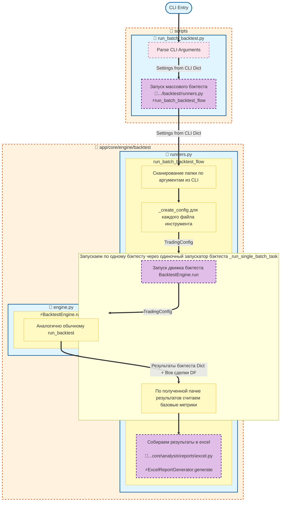

```mermaid
flowchart TB
    %% --- 1. СТИЛИ ---
    classDef folder fill:#fff3e0,stroke:#e65100,stroke-width:2px,stroke-dasharray: 5 5;
    classDef file fill:#e1f5fe,stroke:#01579b,stroke-width:2px;
    classDef func fill:#fff9c4,stroke:#fbc02d,stroke-width:1px;
    classDef ext fill:#e1bee7,stroke:#4a148c,stroke-width:2px,stroke-dasharray: 5 5;
    classDef logic fill:#fce4ec,stroke:#880e4f,stroke-width:1px,stroke-dasharray: 5 5;
    classDef loop fill:#e8f5e9,stroke:#2e7d32,stroke-width:2px;

    %% --- 2. СТРУКТУРА ---
    Entry([CLI Entry]):::file
    %% Папка scripts
    subgraph SCRIPTS ["📂 scripts"]
        subgraph RUN ["📄 run_batch_backtest.py"]
            ParseArgs[Parse CLI Arguments]:::logic
            RunBatchBackExt["Запуск массового бэктеста
            📄.../backtest/runners.py
            ⚡run_batch_backtest_flow"]:::ext
        end
    end
    
    %% Папка app/core/engine/backtest
    subgraph CoreEngine ["📂 app/core/engine/backtest"]
        subgraph S_RUNNERS ["📄 runners.py"]
            subgraph RunBatchBacktest [run_batch_backtest_flow]
                ScanData[Сканирование папки по аргументам из CLI]:::func
                Config[_create_config для каждого файла инструмента]:::func

                subgraph RunThreadPool[Запускаем по одному бэктесту через одиночный запускатор бэктеста _run_single_batch_task]
                    RunBackEngine[Запуск движка бэктеста BacktestEngine.run]:::ext
                    CalcResults[По полученной пачке результатов считаем базовые метрики]:::func
                end

                GenerateReports["Собираем результаты в excel
                📄...core\analysis\reports\excel.py
                ⚡ExcelReportGenerator.generate"]:::ext
            end
        end

        subgraph ENGINE ["📄 engine.py"]
            subgraph BacktestRun [⚡BacktestEngine.run]
                ResultBuild[Аналогично обычному run_backtest]:::func
            end
        end
    end

    %% --- 3. СВЯЗИ ---
    %% run_backtest.py
    Entry ==> ParseArgs
    ParseArgs ==>|Settings from CLI Dict| RunBatchBackExt
    RunBatchBackExt ==>|Settings from CLI Dict| ScanData

    %% runners.py
    ScanData ==> Config
    Config ==>|TradingConfig| RunThreadPool

    %% Engine Flow
    RunBackEngine ==>|TradingConfig| BacktestRun
    ResultBuild ==>|Результаты бэктеста Dict + Все сделки DF| CalcResults

    CalcResults ==> GenerateReports

    %% --- 4. ПРИМЕНЕНИЕ СТИЛЕЙ ---
    class SCRIPTS,CoreEngine folder;

    class RUN,S_RUNNERS,ENGINE file;
    class BacktestRun,RunBatchBacktest func;
```