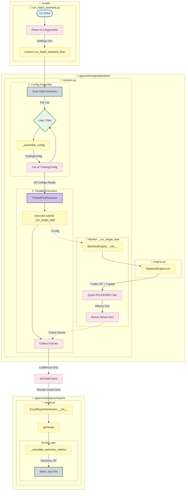

```mermaid
flowchart TB
    %% --- STYLES ---
    classDef file fill:#e1f5fe,stroke:#01579b,stroke-width:2px;
    classDef folder fill:#fff3e0,stroke:#e65100,stroke-width:2px,stroke-dasharray: 5 5;
    classDef func fill:#fff9c4,stroke:#fbc02d,stroke-width:1px;
    classDef logic fill:#fce4ec,stroke:#880e4f,stroke-width:1px,stroke-dasharray: 5 5;
    classDef loop fill:#e8f5e9,stroke:#2e7d32,stroke-width:2px;
    classDef thread fill:#d1c4e9,stroke:#512da8,stroke-width:2px;
    classDef io fill:#cfd8dc,stroke:#455a64,stroke-width:2px;

    %% --- 1. ENTRY POINT ---
    subgraph F_SCRIPTS ["📂 scripts"]
        direction TB
        subgraph S_RUN ["📄 run_batch_backtest.py"]
            direction TB
            Entry([CLI Entry]):::file
            ParseArgs[Parse CLI Arguments]:::logic
            CallRunner[runners.run_batch_backtest_flow]:::func
            
            Entry --> ParseArgs
            ParseArgs -->|Settings Dict| CallRunner
        end
    end

    %% --- 2. CORE BACKTEST ENGINE ---
    subgraph F_CORE ["📂 app/core/engine/backtest"]
        direction TB
        
        subgraph S_RUNNERS ["📄 runners.py"]
            direction TB
            
            %% PREPARATION PHASE
            subgraph PREP ["1. Config Assembly"]
                direction TB
                ScanDir[Scan Data Directory]:::io
                IterFiles{Loop: Files}:::loop
                Assemble[_assemble_config]:::func
                ConfigList[List of TradingConfig]:::logic
                
                CallRunner --> ScanDir
                ScanDir -->|"File List"| IterFiles
                IterFiles --> Assemble
                Assemble -->|TradingConfig| ConfigList
                ConfigList --> IterFiles
            end

            %% EXECUTION PHASE
            subgraph EXEC ["2. Parallel Execution"]
                direction TB
                Executor[ThreadPoolExecutor]:::thread
                SubmitTask[executor.submit _run_single_task]:::func
                CollectResults[Collect Futures]:::logic
                
                ConfigList -- "All Configs Ready" --> Executor
                Executor --> SubmitTask
                SubmitTask --> CollectResults
            end
            
            %% WORKER LOGIC (Running in Thread)
            subgraph WORKER ["👷 Worker: _run_single_task"]
                direction TB
                InitEngine[BacktestEngine.__init__]:::func
                
                %% Lightweight Calc
                CalcMetrics[Quick PnL/DD/WR Calc]:::logic
                ReturnDict[Return Result Dict]:::logic
                
                SubmitTask -.->|Config| InitEngine
                CalcMetrics -->|Metrics Dict| ReturnDict
            end
        end

        subgraph S_ENGINE ["📄 engine.py"]
            direction TB
            RunSim[BacktestEngine.run]:::func
            
            InitEngine --> RunSim
            RunSim -->|Trades DF + Capital| CalcMetrics
        end
    end

    %% --- 3. REPORTING ---
    subgraph F_REP ["📂 app/core/analysis/reports"]
        direction TB
        subgraph S_EXCEL ["📄 excel.py"]
            direction TB
            InitGen[ExcelReportGenerator.__init__]:::func
            GenRep[generate]:::func
            
            subgraph EXCEL_LOGIC ["Excel Logic"]
                direction TB
                CalcSummary[_calculate_summary_metrics]:::func
                WriteXLSX[Write .xlsx File]:::io
            end
            
            InitGen --> GenRep
            GenRep --> CalcSummary
            CalcSummary -->|"Summary DF"| WriteXLSX
        end
    end

    %% --- GLOBAL DATA FLOW ---
    
    %% Aggregation
    ReturnDict -.->|Future Result| CollectResults
    CollectResults -->|"List[Result Dict]"| ToDF[pd.DataFrame]:::logic
    
    %% Reporting connection
    ToDF -->|"Results DataFrame"| InitGen
```