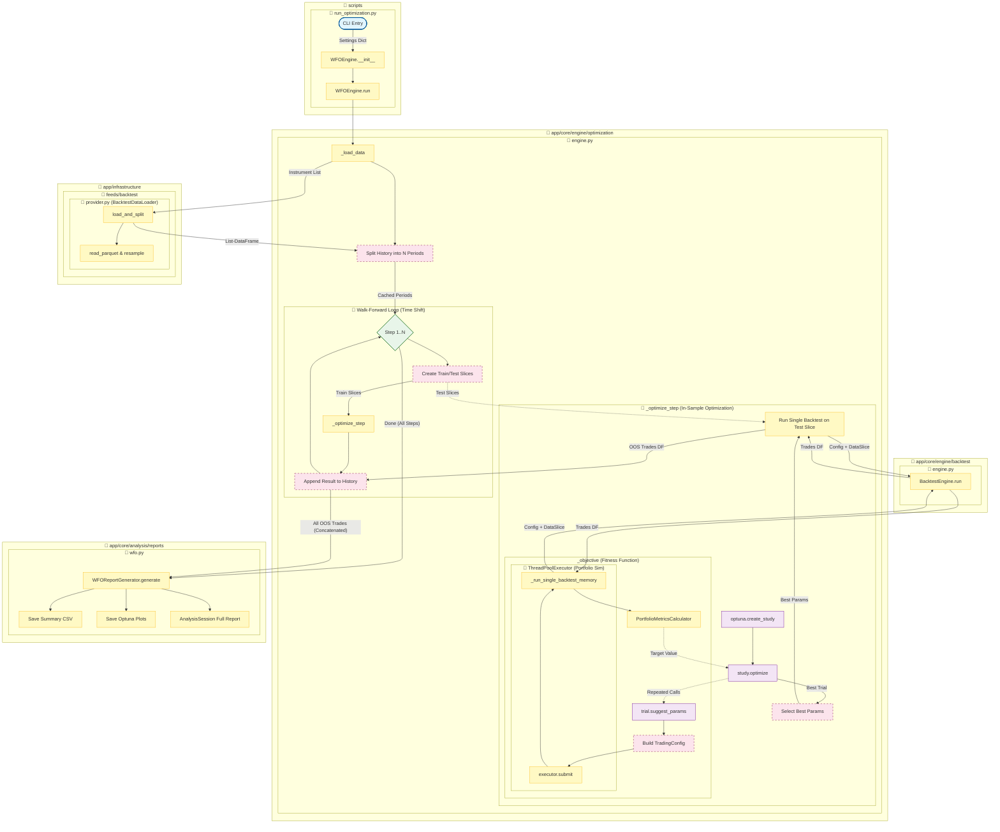

```mermaid
flowchart TB
    %% --- STYLES ---
    classDef file fill:#e1f5fe,stroke:#01579b,stroke-width:2px;
    classDef folder fill:#fff3e0,stroke:#e65100,stroke-width:2px,stroke-dasharray: 5 5;
    classDef func fill:#fff9c4,stroke:#fbc02d,stroke-width:1px;
    classDef logic fill:#fce4ec,stroke:#880e4f,stroke-width:1px,stroke-dasharray: 5 5;
    classDef loop fill:#e8f5e9,stroke:#2e7d32,stroke-width:2px;
    classDef thread fill:#d1c4e9,stroke:#512da8,stroke-width:2px;
    classDef lib fill:#f3e5f5,stroke:#7b1fa2,stroke-width:1px;

    %% --- 1. ENTRY POINT ---
    subgraph F_SCRIPTS ["📂 scripts"]
        direction TB
        subgraph S_RUN ["📄 run_optimization.py"]
            direction TB
            Entry([CLI Entry]):::file
            InitEngine[WFOEngine.__init__]:::func
            RunEngine[WFOEngine.run]:::func
            
            Entry -->|Settings Dict| InitEngine
            InitEngine --> RunEngine
        end
    end

    %% --- 2. OPTIMIZATION ENGINE ---
    subgraph F_CORE_OPT ["📂 app/core/engine/optimization"]
        direction TB
        subgraph S_ENGINE ["📄 engine.py"]
            direction TB
            
            %% 2.1 Data Loading Phase
            LoadData[_load_data]:::func
            SplitDataLogic[Split History into N Periods]:::logic
            
            %% 2.2 WFO Loop Phase
            subgraph WFO_LOOP ["🔄 Walk-Forward Loop (Time Shift)"]
                direction TB
                LoopSteps{"Step 1..N"}:::loop
                SliceData[Create Train/Test Slices]:::logic
                RunStep[_optimize_step]:::func
                CollectOOS[Append Result to History]:::logic
                
                LoopSteps --> SliceData
                SliceData -->|"Train Slices"| RunStep
                RunStep --> CollectOOS
                CollectOOS --> LoopSteps
            end
            
            %% 2.3 Optimization Phase (Inside Step)
            subgraph OPT_STEP ["🎯 _optimize_step (In-Sample Optimization)"]
                direction TB
                CreateStudy[optuna.create_study]:::lib
                OptunaLoop[study.optimize]:::lib
                SelectBest[Select Best Params]:::logic
                RunTestOOS[Run Single Backtest on Test Slice]:::func
                
                subgraph OBJECTIVE ["_objective (Fitness Function)"]
                    direction TB
                    SuggestParams[trial.suggest_params]:::lib
                    BuildConfig[Build TradingConfig]:::logic
                    
                    subgraph PARALLEL ["🧵 ThreadPoolExecutor (Portfolio Sim)"]
                        direction TB
                        SubmitTask[executor.submit]:::func
                        RunMemTest[_run_single_backtest_memory]:::func
                        
                        SubmitTask --> RunMemTest
                    end
                    
                    CalcMetrics[PortfolioMetricsCalculator]:::func
                    
                    SuggestParams --> BuildConfig
                    BuildConfig --> SubmitTask
                    RunMemTest --> CalcMetrics
                end
                
                CreateStudy --> OptunaLoop
                OptunaLoop -.->|Repeated Calls| SuggestParams
                CalcMetrics -.->|Target Value| OptunaLoop
                
                OptunaLoop -->|"Best Trial"| SelectBest
                SelectBest -->|"Best Params"| RunTestOOS
            end
            
            %% Connections inside Engine
            RunEngine --> LoadData
            LoadData --> SplitDataLogic
            SplitDataLogic -->|Cached Periods| LoopSteps
            
            %% OOS Data Flow
            SliceData -.->|"Test Slices"| RunTestOOS
            RunTestOOS -->|"OOS Trades DF"| CollectOOS
        end
    end

    %% --- 3. INFRASTRUCTURE (DATA) ---
    subgraph F_INFRA ["📂 app/infrastructure"]
        direction TB
        subgraph F_FEEDS ["📂 feeds/backtest"]
            direction TB
            subgraph S_LOADER ["📄 provider.py (BacktestDataLoader)"]
                direction TB
                LoaderLoad[load_and_split]:::func
                ReadParquet[read_parquet & resample]:::func
                
                LoaderLoad --> ReadParquet
            end
        end
    end

    %% --- 4. BACKTEST CORE (Used in optimization) ---
    subgraph F_CORE_BT ["📂 app/core/engine/backtest"]
        direction TB
        subgraph S_BT_ENGINE ["📄 engine.py"]
            BTRun[BacktestEngine.run]:::func
        end
    end

    %% --- 5. REPORTING ---
    subgraph F_REP ["📂 app/core/analysis/reports"]
        direction TB
        subgraph S_WFO_REP ["📄 wfo.py"]
            direction TB
            GenReport[WFOReportGenerator.generate]:::func
            SaveCSV[Save Summary CSV]:::func
            SaveHTML[Save Optuna Plots]:::func
            FinalAnalysis[AnalysisSession Full Report]:::func
            
            GenReport --> SaveCSV & SaveHTML & FinalAnalysis
        end
    end

    %% --- GLOBAL DATA FLOW CONNECTIONS ---
    
    %% Loading Data
    LoadData -->|Instrument List| LoaderLoad
    LoaderLoad -->|List-DataFrame| SplitDataLogic
    
    %% Running Backtests (In-Memory)
    RunMemTest -->|Config + DataSlice| BTRun
    RunTestOOS -->|Config + DataSlice| BTRun
    BTRun -->|Trades DF| RunMemTest
    BTRun -->|Trades DF| RunTestOOS
    
    %% Reporting Flow
    LoopSteps -- "Done (All Steps)" --> GenReport
    CollectOOS -->|"All OOS Trades (Concatenated)"| GenReport
```