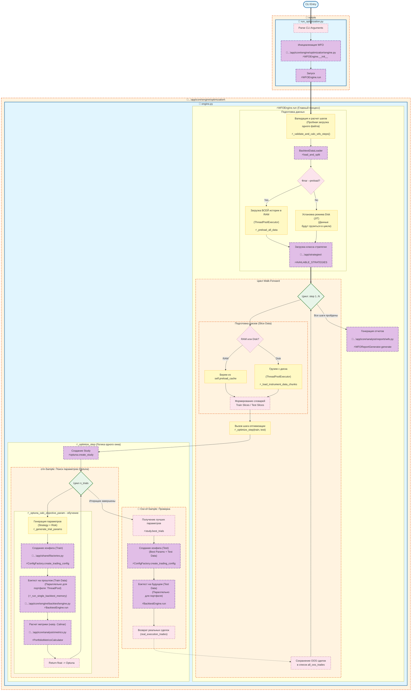

```mermaid
flowchart TB
    %% ==========================================
    %% 1. СТИЛИ
    %% ==========================================
    classDef folder fill:#fff3e0,stroke:#e65100,stroke-width:2px,stroke-dasharray: 5 5;
    classDef file fill:#e1f5fe,stroke:#01579b,stroke-width:2px;
    classDef func fill:#fff9c4,stroke:#fbc02d,stroke-width:1px;
    classDef ext fill:#e1bee7,stroke:#4a148c,stroke-width:2px,stroke-dasharray: 5 5;
    classDef logic fill:#fce4ec,stroke:#880e4f,stroke-width:1px,stroke-dasharray: 5 5;
    classDef loop fill:#e8f5e9,stroke:#2e7d32,stroke-width:2px;

    %% ==========================================
    %% 2. ТОЧКА ВХОДА (CLI)
    %% ==========================================
    Entry([CLI Entry]):::file

    %% --- ПАПКА SCRIPTS ---
    subgraph SCRIPTS ["📂 scripts"]
        direction TB
        subgraph RUN ["📄 run_optimization.py"]
            direction TB
            ParseArgs[Parse CLI Arguments]:::logic
            InitOptim["Инициализация WFO
            📄...\app\core\engine\optimization\engine.py
            ⚡WFOEngine.__init__"]:::ext
            RunOptimCall["Запуск
            ⚡WFOEngine.run"]:::ext
        end
    end

    %% ==========================================
    %% 3. ЯДРО ОПТИМИЗАЦИИ
    %% ==========================================
    subgraph OptimEngine ["📂...\app\core\engine\optimization\"]
        direction TB

        subgraph Runner ["📄 engine.py"]
            direction TB

            %% --- 3.1 ГЛАВНЫЙ МЕТОД RUN ---
            subgraph EngineRun ["⚡WFOEngine.run (Главный процесс)"]
                direction TB

                %% Подготовка данных
                subgraph PrepPhase [Подготовка данных]
                    direction TB
                    CalcSteps["Валидация и расчет шагов
                    (Пробная загрузка одного файла)
                    ⚡_validate_and_calc_wfo_steps()
"]:::func
                    
                    DataLoaderCall["BacktestDataLoader
                    ⚡load_and_split"]:::ext

                    PreloadCheck{Флаг --preload?}:::logic
                    
                    PreloadRAM["Загрузка ВСЕЙ истории в RAM
                    (ThreadPoolExecutor)
                    ⚡_preload_all_data"]:::func

                    PreloadDisk["Установка режима Disk (JIT)
                    (Данные будут грузиться в цикле)"]:::func
                    
                    SetStrategy["Загрузка класса стратегии
                    📂...\app\strategies\
                    ⚡AVAILABLE_STRATEGIES"]:::ext
                end

                %% Главный цикл
                subgraph MainLoopBlock [Цикл Walk-Forward]
                    direction TB
                    LoopStart{Цикл: step 1..N}:::loop
                    
                    subgraph DataSlicing ["Подготовка срезов (Slice Data)"]
                        direction TB
                        CheckMode{RAM или Disk?}:::logic
                        FromCache["Берем из self.preload_cache"]:::func
                        FromDisk["Грузим с диска
                        (ThreadPoolExecutor)
                        ⚡_load_instrument_data_chunks"]:::func
                        CreateSlices["Формирование словарей
                        Train Slices / Test Slices"]:::logic
                        
                        CheckMode -- RAM --> FromCache --> CreateSlices
                        CheckMode -- Disk --> FromDisk --> CreateSlices
                    end

                    %% ВЫЗОВ ШАГА
                    CallOptimize["Вызов шага оптимизации
                    ⚡_optimize_step(train, test)"]:::func

                    CollectRes["Сохранение OOS сделок
                    в список all_oos_trades"]:::logic
                end

                %% Отчетность
                ReportGen["Генерация отчетов
                📄...\app\core\analysis\reports\wfo.py
                ⚡WFOReportGenerator.generate"]:::ext
            end

            %% --- 3.2 ДЕТАЛИЗАЦИЯ ШАГА (_optimize_step) ---
            subgraph OptStepDetail ["⚡_optimize_step (Логика одного окна)"]
                direction TB
                
                CreateStudy["Создание Study
                ⚡optuna.create_study"]:::ext

                %% ФАЗА 1: IN-SAMPLE (Поиск параметров)
                subgraph InSamplePhase ["🔥In-Sample: Поиск параметров (Optuna)"]
                    direction TB
                    OptLoopStart{Цикл n_trials}:::loop
                    
                    subgraph ObjectiveFunc ["⚡_optuna_calc_objective_param - обучение"]
                        direction TB
                        Suggest["Генерация параметров
                        (Strategy + Risk)
                        ⚡_generate_trial_params"]:::func

                        ConfigIS["Создание конфига (Train)
                        📄...\app\shared\factories.py
                        ⚡ConfigFactory.create_trading_config"]:::ext

                        BacktestIS["Бэктест на прошлом (Train Data)
                        (Параллельно для портфеля: ThreadPool)
                        (⚡_run_single_backtest_memory)
                        📄...\app\core\engine\backtest\engine.py
                        ⚡BacktestEngine.run"]:::ext

                        MetricsIS["Расчет метрики (напр. Calmar)
                        📄...\app\core\analysis\metrics.py
                        ⚡PortfolioMetricsCalculator"]:::ext
                        
                        ReturnMetric[Return float -> Optuna]:::logic
                        
                        Suggest --> ConfigIS --> BacktestIS --> MetricsIS --> ReturnMetric
                    end
                end

                %% ФАЗА 2: OUT-OF-SAMPLE (Проверка)
                subgraph OutSamplePhase ["🧊 Out-of-Sample: Проверка"]
                    direction TB
                    GetBest["Получение лучших параметров
                    ⚡study.best_trials"]:::logic

                    ConfigOOS["Создание конфига (Test)
                    (Best Params + Test Data)
                    ⚡ConfigFactory.create_trading_config"]:::ext

                    BacktestOOS["Бэктест на будущем (Test Data)
                    (Параллельно для портфеля)
                    ⚡BacktestEngine.run"]:::ext
                    
                    ReturnOOS["Возврат реальных сделок (real_execution_trades)"]:::logic
                end
            end
        end
    end

    %% ==========================================
    %% 4. СВЯЗИ ПОТОКОВ
    %% ==========================================

    %% CLI -> Init
    Entry ==> ParseArgs
    ParseArgs --> InitOptim
    InitOptim --> RunOptimCall

    %% Run -> Prep
    RunOptimCall ==> CalcSteps
    CalcSteps --> DataLoaderCall
    DataLoaderCall --> PreloadCheck
    PreloadCheck -- Yes --> PreloadRAM
    PreloadCheck -- No --> PreloadDisk
    PreloadRAM --> SetStrategy
    PreloadDisk --> SetStrategy

    %% Prep -> Loop
    SetStrategy ==> LoopStart
    LoopStart --> CheckMode
    CreateSlices --> CallOptimize

    %% Loop -> Optimize Step Detail
    %% Пунктир показывает переход внутрь функции
    CallOptimize --> CreateStudy
    
    %% Inside Optimize Step
    CreateStudy --> OptLoopStart
    OptLoopStart --> Suggest
    ReturnMetric --> OptLoopStart
    
    %% Переход от In-Sample к OOS
    OptLoopStart -- Итерации завершены --> GetBest
    GetBest --> ConfigOOS --> BacktestOOS --> ReturnOOS

    %% Return from Detail -> Loop
    ReturnOOS -.-> CollectRes
    CollectRes --> LoopStart

    %% Loop End -> Report
    LoopStart -- Все шаги пройдены --> ReportGen

    %% ==========================================
    %% 5. ПРИМЕНЕНИЕ СТИЛЕЙ
    %% ==========================================
    class SCRIPTS,OptimEngine,MainLoopBlock,InSamplePhase,OutSamplePhase,DataSlicing folder;
    class RUN,Runner file;
```