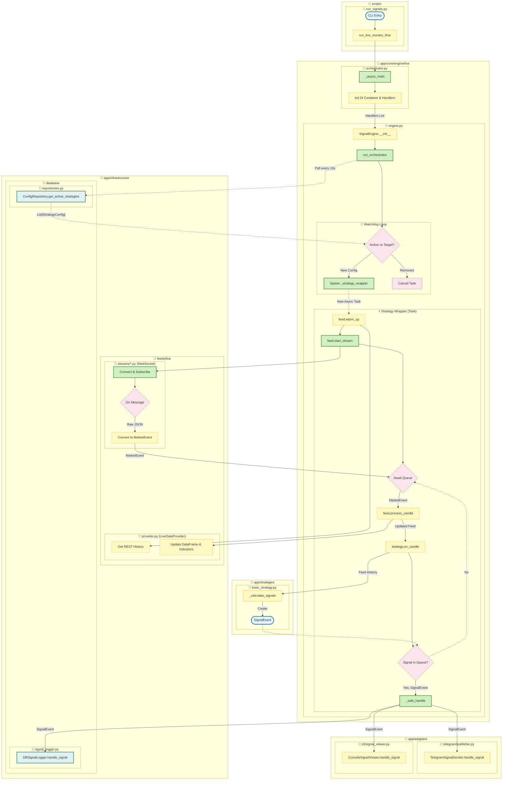

```mermaid
flowchart TB
    %% --- STYLES ---
    classDef file fill:#e1f5fe,stroke:#01579b,stroke-width:2px;
    classDef folder fill:#fff3e0,stroke:#e65100,stroke-width:2px,stroke-dasharray: 5 5;
    classDef func fill:#fff9c4,stroke:#fbc02d,stroke-width:1px;
    classDef logic fill:#fce4ec,stroke:#880e4f,stroke-width:1px,stroke-dasharray: 5 5;
    classDef async fill:#d0f0c0,stroke:#2e7d32,stroke-width:2px;
    classDef db fill:#e0f2f1,stroke:#00695c,stroke-width:2px;

    %% --- 1. ENTRY POINT ---
    subgraph F_SCRIPTS ["📂 scripts"]
        direction TB
        subgraph S_RUN ["📄 run_signals.py"]
            direction TB
            Entry([CLI Entry]):::file
            RunFlow[run_live_monitor_flow]:::func
            
            Entry --> RunFlow
        end
    end

    %% --- 2. ORCHESTRATOR & ENGINE ---
    subgraph F_CORE ["📂 app/core/engine/live"]
        direction TB
        
        subgraph S_ORCH ["📄 orchestrator.py"]
            direction TB
            AsyncMain[_async_main]:::async
            InitDeps[Init DI Container & Handlers]:::func
            
            RunFlow --> AsyncMain
            AsyncMain --> InitDeps
        end

        subgraph S_ENGINE ["📄 engine.py"]
            direction TB
            EngineInit[SignalEngine.__init__]:::func
            RunOrchLoop[run_orchestrator]:::async
            
            subgraph WATCHDOG ["🔄 Watchdog Loop"]
                direction TB
                DiffLogic{"Active vs Target?"}:::logic
                SpawnTask[Spawn _strategy_wrapper]:::async
                KillTask[Cancel Task]:::logic
            end
            
            subgraph WORKER ["⚡ Strategy Wrapper (Task)"]
                direction TB
                WarmupCall[feed.warm_up]:::func
                StartStreamCall[feed.start_stream]:::async
                
                StreamLoop{"Await Queue"}:::logic
                ProcessData[feed.process_candle]:::func
                RunStrat[strategy.on_candle]:::func
                CheckSig{"Signal in Queue?"}:::logic
                Broadcast[_safe_handle]:::async
            end
            
            InitDeps -->|Handlers List| EngineInit
            EngineInit --> RunOrchLoop
            RunOrchLoop --> DiffLogic
            
            DiffLogic -->|New Config| SpawnTask
            DiffLogic -->|Removed| KillTask
            
            SpawnTask -.->|New Async Task| WarmupCall
            WarmupCall --> StartStreamCall
            StartStreamCall --> StreamLoop
            
            StreamLoop -->|MarketEvent| ProcessData
            ProcessData -->|Updated Feed| RunStrat
            RunStrat --> CheckSig
            
            CheckSig -->|Yes: SignalEvent| Broadcast
            CheckSig -.->|No| StreamLoop
        end
    end

    %% --- 3. INFRASTRUCTURE (FEEDS) ---
    subgraph F_INFRA ["📂 app/infrastructure"]
        direction TB
        
        subgraph F_FEEDS ["📂 feeds/live"]
            direction TB
            subgraph S_PROV ["📄 provider.py (LiveDataProvider)"]
                direction TB
                WarmupRest[Get REST History]:::func
                BufferUpdate[Update DataFrame & Indicators]:::func
                
                WarmupCall --> WarmupRest
                ProcessData --> BufferUpdate
            end
            
            subgraph S_STREAMS ["📄 streams/*.py (WebSocket)"]
                direction TB
                WSConnect[Connect & Subscribe]:::async
                WSListen{"On Message"}:::logic
                ToEvent[Convert to MarketEvent]:::func
                
                StartStreamCall --> WSConnect
                WSConnect --> WSListen
                WSListen -->|Raw JSON| ToEvent
                ToEvent -->|MarketEvent| StreamLoop
            end
        end
        
        subgraph F_DB ["📂 database"]
            direction TB
            subgraph S_REPO ["📄 repositories.py"]
                FetchConfigs[ConfigRepository.get_active_strategies]:::db
            end
            subgraph S_DBLOG ["📄 signal_logger.py"]
                LogSignal[DBSignalLogger.handle_signal]:::db
            end
        end
    end

    %% --- 4. STRATEGY ---
    subgraph F_STRAT ["📂 app/strategies"]
        direction TB
        subgraph S_BASE ["📄 base_strategy.py"]
            direction TB
            CalcLogic[_calculate_signals]:::func
            
            RunStrat -->|Feed History| CalcLogic
            CalcLogic -->|Create| SignalEvent([SignalEvent]):::file
        end
    end

    %% --- 5. ADAPTERS (OUTPUT) ---
    subgraph F_ADAPTERS ["📂 app/adapters"]
        direction TB
        subgraph S_TG ["📄 telegram/publisher.py"]
            TgSend[TelegramSignalSender.handle_signal]:::func
        end
        subgraph S_CLI ["📄 cli/signal_viewer.py"]
            CliPrint[ConsoleSignalViewer.handle_signal]:::func
        end
    end

    %% --- CROSS-MODULE CONNECTIONS ---
    
    %% DB -> Orchestrator
    RunOrchLoop -.->|Poll every 10s| FetchConfigs
    FetchConfigs -.->|"List[StrategyConfig]"| DiffLogic
    
    %% Broadcast -> Handlers
    Broadcast -->|SignalEvent| TgSend
    Broadcast -->|SignalEvent| LogSignal
    Broadcast -->|SignalEvent| CliPrint
    
    %% Strategy -> Queue interaction
    SignalEvent -.-> CheckSig
```